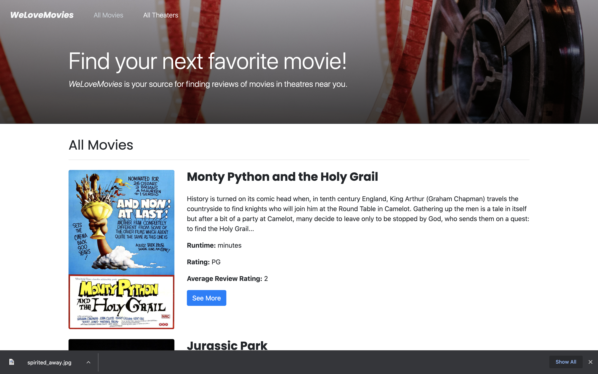
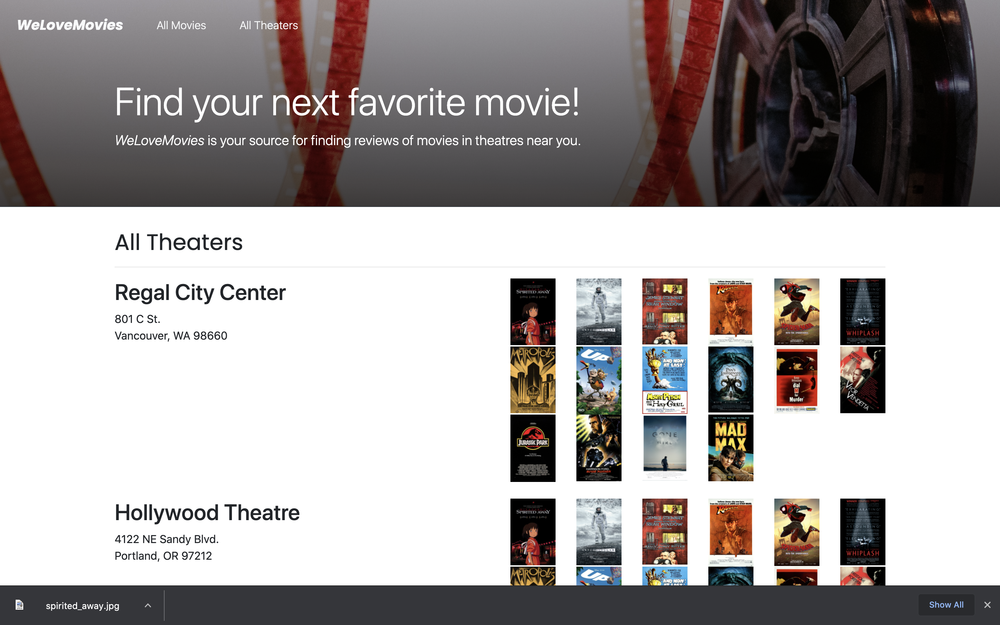
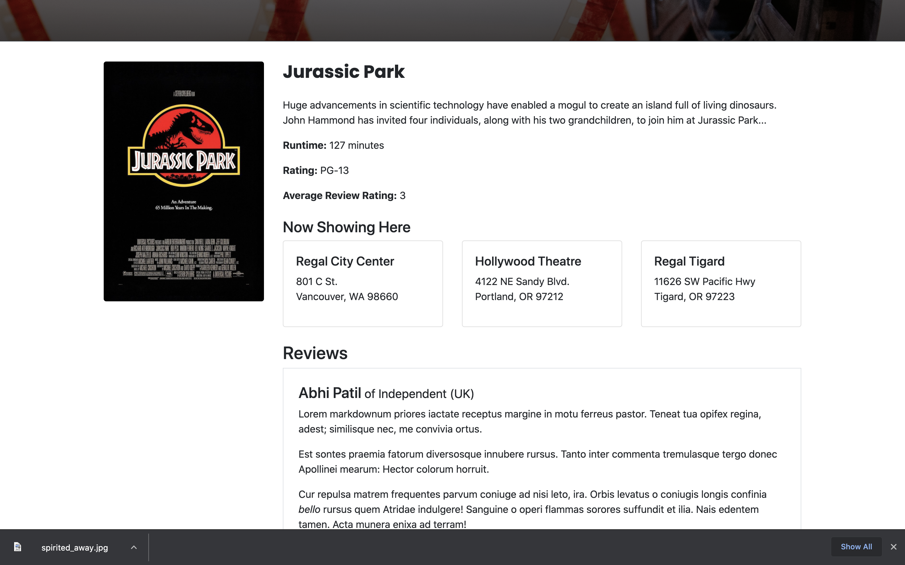
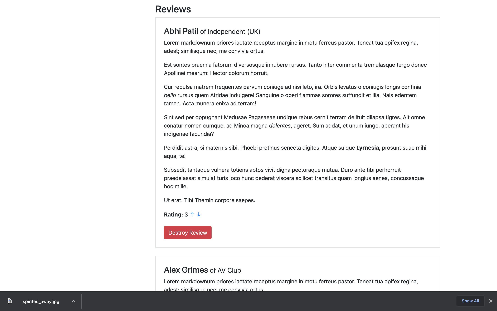

## Project We-Love-Movies

> This project was created in the Thinkful Engineering Flex program.

> You've been hired on as a backend developer at a new startup called WeLoveMovies! As another developer works on the design and frontend experience, you have been tasked with setting up a database and building out specific routes so that users can gain access to data about movies, theaters, and reviews.

## Learning Objectives

This project was designed to test my ability to build complex servers and access data through a database. The following skills were required to complete this project:

- Install and use common middleware packages
- Receive requests through routes
- Run tests from the command line
- Access relevant information through route and query parameters
- Create an error handler for the case where a route doesn't exist
- Build an API following RESTful design principles
- Create and customize a knexfile.js file
- Create a connection to your database with Knex
- Write database queries to complete CRUD routes in an Express server
- Return joined and nested data with Knex
- Write database migrations using Knex's migration tool
- Deploy your backend server to a cloud service

## Built With

- Express
- Node.js
- Knex
- PostgreSQL
- CORS

## Deployment

- [We Love Movies App](https://we-love-movies-client-one.vercel.app/)

## Screenshots

